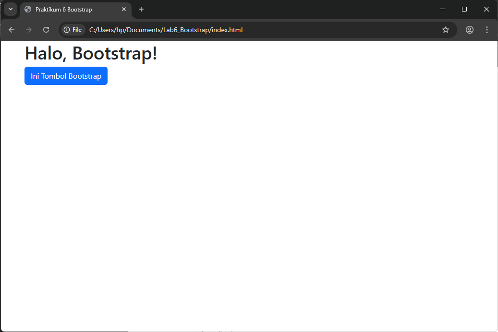
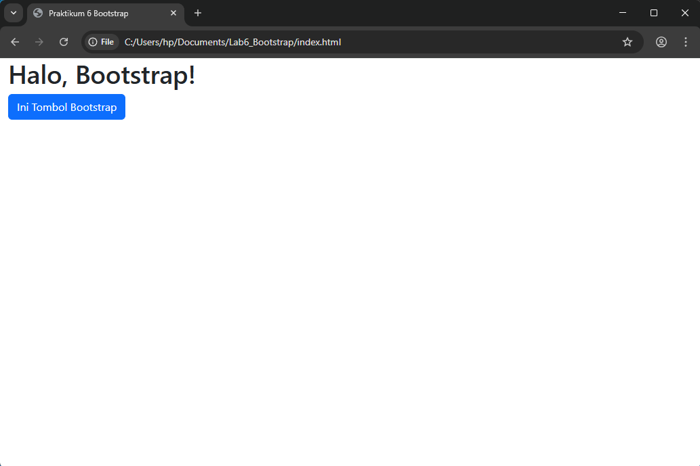
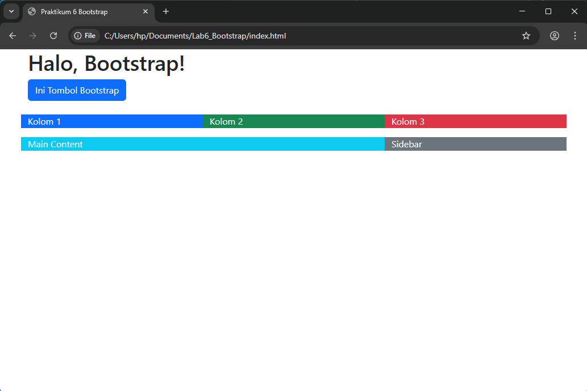
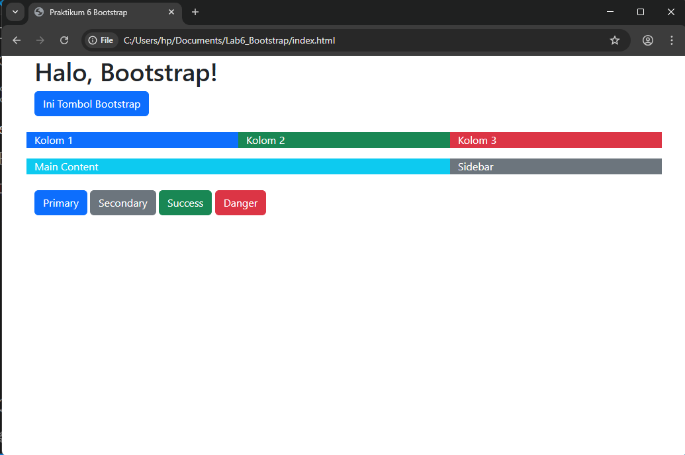
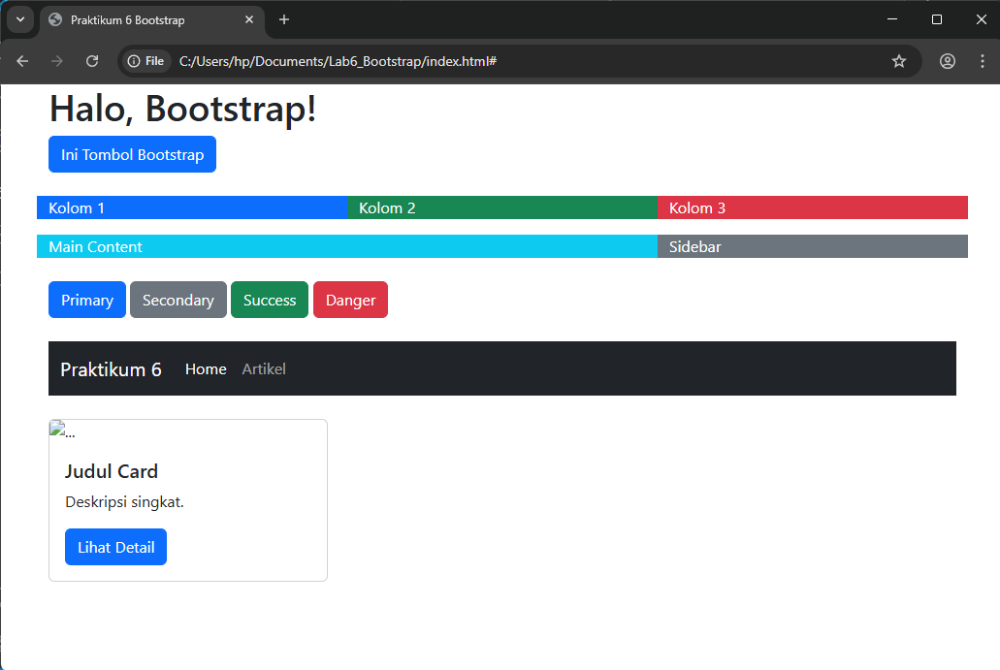
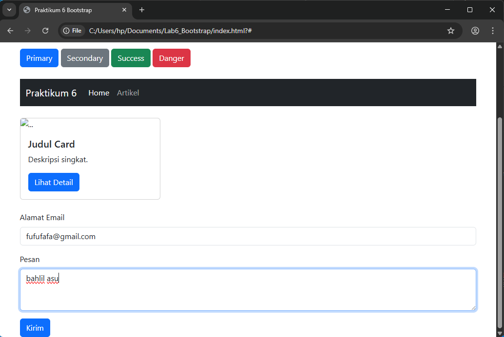
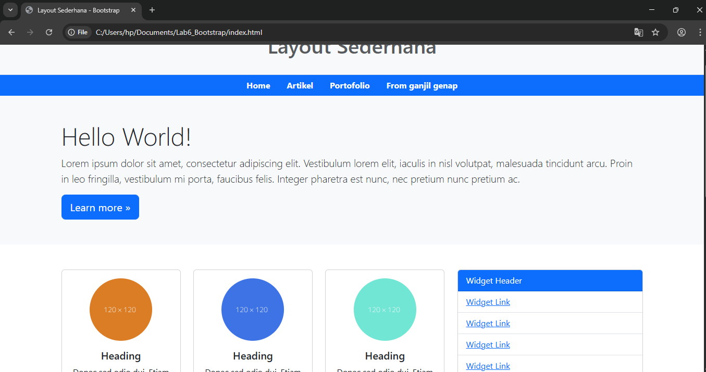
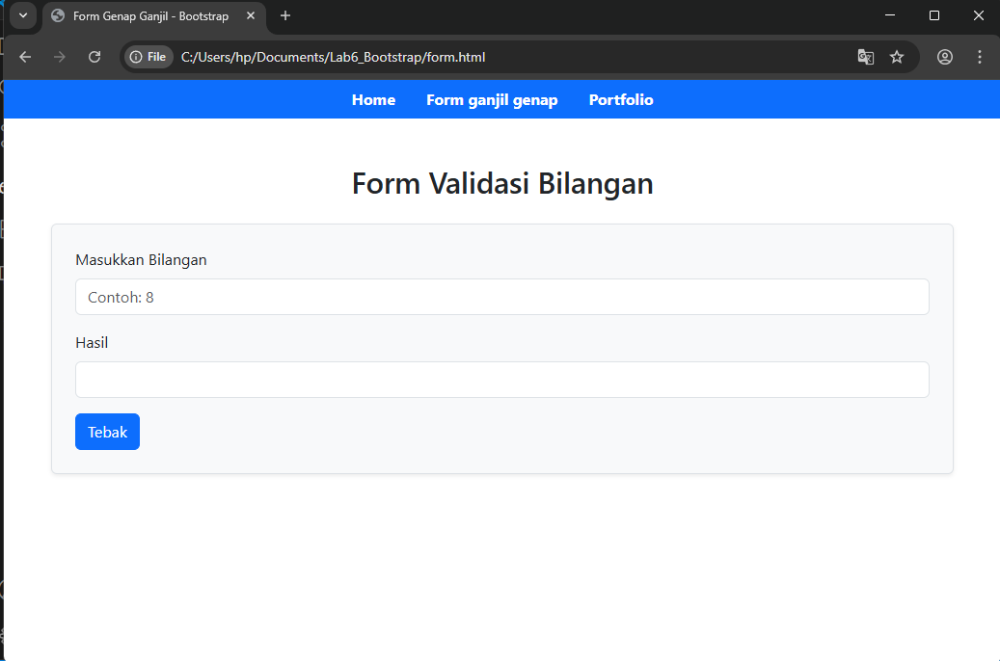
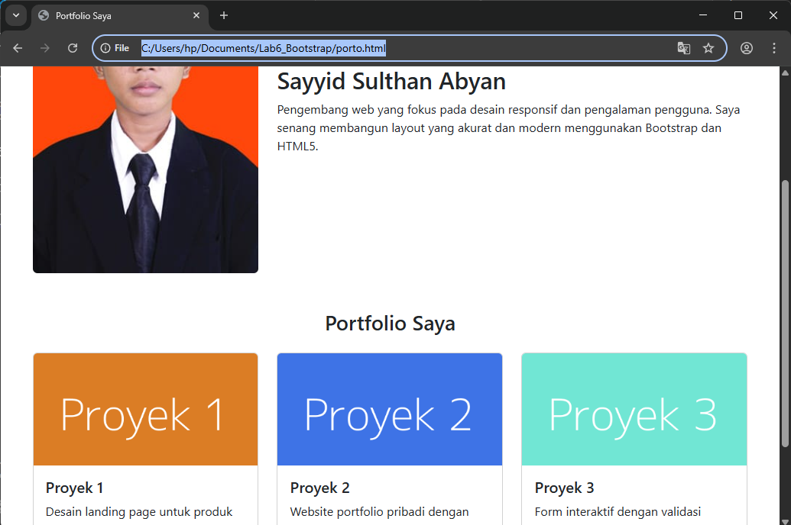

# Lab6_Bootstrap

<p>Nama  : Sayyid Sulthan Abyan</p>
<p>NIM   : 312410496</p>
<p>Kelas : TI.24.A.5</p>

## Langkah-langkah Latihan Praktikum

---

##  Penjelasan Langkah Latihan Praktikum 6

### 1. Setup Bootstrap
Pada langkah ini, saya menambahkan Bootstrap ke dalam halaman HTML menggunakan CDN. File CSS Bootstrap disisipkan di dalam `<head>`, dan file JavaScript Bootstrap di akhir `<body>`. Ini memungkinkan saya menggunakan semua komponen dan sistem grid Bootstrap tanpa mengunduh file secara lokal.

```html
<!DOCTYPE html>
<html lang="id">
<head>
  <meta charset="UTF-8">
  <meta name="viewport" content="width=device-width, initial-scale=1.0">
  <title>Praktikum 6 Bootstrap</title>
  <link href="https://cdn.jsdelivr.net/npm/bootstrap@5.3.3/dist/css/bootstrap.min.css" rel="stylesheet">
</head>
<body>
  <div class="container">
    <h1>Halo, Bootstrap!</h1>
    <button class="btn btn-primary">Ini Tombol Bootstrap</button>
  </div>

  <script src="https://cdn.jsdelivr.net/npm/bootstrap@5.3.3/dist/js/bootstrap.bundle.min.js"></script>
</body>
</html>
```

Hasil:


---

### 2. Container
Saya mencoba dua jenis container:
- `.container` untuk lebar tetap yang responsif
- `.container-fluid` untuk lebar penuh 100%

Tujuannya adalah memahami bagaimana Bootstrap mengatur perataan dan lebar konten secara otomatis.
```html
<div class="container">
    <h1>Halo, Bootstrap!</h1>
    <button class="btn btn-primary">Ini Tombol Bootstrap</button>
  </div>
```

Hasil:


```html
<div class="container-fluid">
    <h1>Halo, Bootstrap!</h1>
    <button class="btn btn-primary">Ini Tombol Bootstrap</button>
  </div>
```

Hasil:


---

### 3. Grid System
Saya menggunakan sistem grid 12 kolom Bootstrap untuk menggantikan layout manual dengan float. Saya membuat layout dengan:
- `.row` sebagai pembungkus kolom
- `.col-md-8` untuk konten utama
- `.col-md-4` untuk sidebar

Grid ini membuat layout responsif dan mudah diatur di berbagai ukuran layar.

```html
<div class="container mt-4">
  <div class="row">
    <div class="col-4 bg-primary text-white">Kolom 1</div>
    <div class="col-4 bg-success text-white">Kolom 2</div>
    <div class="col-4 bg-danger text-white">Kolom 3</div>
  </div>

  <div class="row mt-3">
    <div class="col-md-8 bg-info text-white">Main Content</div>
    <div class="col-md-4 bg-secondary text-white">Sidebar</div>
  </div>
</div>
```

Hasil:


---

### 4. Komponen: Button
Saya mencoba berbagai jenis tombol Bootstrap dengan class:
- `.btn-primary`
- `.btn-secondary`
- `.btn-success`
- `.btn-danger`

Setiap tombol memiliki warna dan gaya yang berbeda sesuai fungsinya.

```html
<div class="container mt-4">
<button class="btn btn-primary">Primary</button>
<button class="btn btn-secondary">Secondary</button>
<button class="btn btn-success">Success</button>
<button class="btn btn-danger">Danger</button>
</div>
```

Hasil:


---

### 5. Komponen: Navbar
Saya membuat navigasi horizontal menggunakan komponen `<nav>` Bootstrap. Navigasi ini berisi link: Home, Artikel, About, dan Kontak. Saya menggunakan class:
- `.navbar`
- `.nav`
- `.nav-link`
- `.bg-primary` untuk warna latar

Tampilannya mirip dengan layout Praktikum 4.

```html
<div class="container mt-4">
  <nav class="navbar navbar-expand-lg navbar-dark bg-dark">
    <div class="container-fluid">
      <a class="navbar-brand" href="#">Praktikum 6</a>
      <button class="navbar-toggler" type="button" data-bs-toggle="collapse" data-bs-target="#navbarNav">
        <span class="navbar-toggler-icon"></span>
      </button>
      <div class="collapse navbar-collapse" id="navbarNav">
        <ul class="navbar-nav">
          <li class="nav-item"><a class="nav-link active" href="#">Home</a></li>
          <li class="nav-item"><a class="nav-link" href="#">Artikel</a></li>
        </ul>
      </div>
    </div>
  </nav>
</div>
```

Hasil:


---

### 6. Komponen: Card
Saya mengganti struktur `.box` dan `.widget-box` dari Praktikum 4 dengan komponen `.card`. Setiap card berisi gambar, judul, deskripsi, dan tombol "View detail". Saya juga menggunakan class `.rounded-circle` untuk membuat gambar berbentuk lingkaran.

```html
<div class="container mt-4">
  <div class="card" style="width: 18rem;">
    
    <div class="card-body">
      <h5 class="card-title">Judul Card</h5>
      <p class="card-text">Deskripsi singkat.</p>
      <a href="#" class="btn btn-primary">Lihat Detail</a>
    </div>
  </div>
</div>
```

Hasil:


---

### 7. Komponen: Form
Saya refactor form dari Praktikum 5 menggunakan class Bootstrap:
- `.form-control` untuk input dan output
- `.form-label` untuk label
- `.btn` untuk tombol

Form ini digunakan untuk mengecek apakah bilangan yang dimasukkan adalah genap atau ganjil, dan tampilannya jauh lebih rapi dibanding versi manual.

```html
<div class="container mt-4">
<form class="mt-4">
  <div class="mb-3">
    <label for="emailInput" class="form-label">Alamat Email</label>
    <input type="email" class="form-control" id="emailInput" placeholder="nama@contoh.com">
  </div>
  <div class="mb-3">
    <label for="pesanText" class="form-label">Pesan</label>
    <textarea class="form-control" id="pesanText" rows="3"></textarea>
  </div>
  <button type="submit" class="btn btn-primary">Kirim</button>
</form>
</div>
```

Hasil:



---

## pertanyaan dan tugas

### 8. Refactor Layout Praktikum 4
Saya mengganti seluruh layout manual dari Praktikum 4 dengan versi Bootstrap:
- Navigasi menggunakan `<nav>` Bootstrap
- Konten dan sidebar menggunakan `.row` dan `.col-md-*`
- Widget dan box diganti dengan `.card`

```html
<!DOCTYPE html>
<html lang="id">
  <head>
    <meta charset="UTF-8" />
    <meta name="viewport" content="width=device-width, initial-scale=1.0" />
    <title>Layout Sederhana - Bootstrap</title>
    <link
      href="https://cdn.jsdelivr.net/npm/bootstrap@5.3.3/dist/css/bootstrap.min.css"
      rel="stylesheet"
    />
  </head>
  <body>
    <!-- Header -->
    <header class="bg-light py-4 border-bottom">
      <div class="container">
        <h1 class="text-center text-muted">Layout Sederhana</h1>
      </div>
    </header>

    <!-- Navbar -->
    <nav class="bg-primary">
      <div class="container">
        <ul class="nav justify-content-center">
          <li class="nav-item">
            <a class="nav-link text-white fw-bold active" href="home.html"
              >Home</a
            >
          </li>
          <li class="nav-item">
            <a class="nav-link text-white fw-bold" href="artikel.html"
              >Artikel</a
            >
          </li>
          <li class="nav-item">
            <a class="nav-link text-white fw-bold" href="porto.html"
              >Portofolio</a
            >
          </li>
          <li class="nav-item">
            <a class="nav-link text-white fw-bold" href="Form.html"
              >From ganjil genap</a
            >
          </li>
        </ul>
      </div>
    </nav>

    <!-- Hero Section -->
    <section class="bg-light py-5">
      <div class="container">
        <h1 class="display-5">Hello World!</h1>
        <p class="lead">
          Lorem ipsum dolor sit amet, consectetur adipiscing elit. Vestibulum
          lorem elit, iaculis in nisl volutpat, malesuada tincidunt arcu. Proin
          in leo fringilla, vestibulum mi porta, faucibus felis. Integer
          pharetra est nunc, nec pretium nunc pretium ac.
        </p>
        <a href="home.html" class="btn btn-primary btn-lg"
          >Learn more &raquo;</a
        >
      </div>
    </section>

    <!-- Main Content & Sidebar -->
    <div class="container my-5">
      <div class="row">
        <!-- Main Content -->
        <div class="col-md-8">
          <div class="row g-4">
            <div class="col-md-4">
              <div class="card text-center">
                
                <div class="card-body">
                  <h5 class="card-title">Heading</h5>
                  <p class="card-text">
                    Donec sed odio dui. Etiam porta sem malesuada magna mollis
                    euismod.
                  </p>
                  <a href="#" class="btn btn-outline-primary">View detail</a>
                </div>
              </div>
            </div>
            <div class="col-md-4">
              <div class="card text-center">
                
                <div class="card-body">
                  <h5 class="card-title">Heading</h5>
                  <p class="card-text">
                    Donec sed odio dui. Etiam porta sem malesuada magna mollis
                    euismod.
                  </p>
                  <a href="#" class="btn btn-outline-primary">View detail</a>
                </div>
              </div>
            </div>
            <div class="col-md-4">
              <div class="card text-center">
                
                <div class="card-body">
                  <h5 class="card-title">Heading</h5>
                  <p class="card-text">
                    Donec sed odio dui. Etiam porta sem malesuada magna mollis
                    euismod.
                  </p>
                  <a href="#" class="btn btn-outline-primary">View detail</a>
                </div>
              </div>
            </div>
          </div>

          <!-- Artikel -->
          <hr class="my-5" />
          <div class="mb-5">
            <h2>First featurette heading.</h2>
            <div class="d-flex">
              
              <p>
                Lorem ipsum dolor sit amet, consectetur adipiscing elit.
                Vestibulum lorem elit, iaculis in nisl volutpat, malesuada
                tincidunt arcu. Proin in leo fringilla, vestibulum mi porta,
                faucibus felis. Integer pharetra est nunc, nec pretium nunc
                pretium ac.
              </p>
            </div>
          </div>

          <div>
            <h2>First featurette heading.</h2>
            <div class="d-flex flex-row-reverse">
              
              <p>
                Lorem ipsum dolor sit amet, consectetur adipiscing elit.
                Vestibulum lorem elit, iaculis in nisl volutpat, malesuada
                tincidunt arcu. Proin in leo fringilla, vestibulum mi porta,
                faucibus felis. Integer pharetra est nunc, nec pretium nunc
                pretium ac.
              </p>
            </div>
          </div>
        </div>

        <!-- Sidebar -->
        <div class="col-md-4">
          <div class="card mb-4">
            <div class="card-header bg-primary text-white">Widget Header</div>
            <ul class="list-group list-group-flush">
              <li class="list-group-item"><a href="#">Widget Link</a></li>
              <li class="list-group-item"><a href="#">Widget Link</a></li>
              <li class="list-group-item"><a href="#">Widget Link</a></li>
              <li class="list-group-item"><a href="#">Widget Link</a></li>
              <li class="list-group-item"><a href="#">Widget Link</a></li>
            </ul>
          </div>

          <div class="card">
            <div class="card-header bg-success text-white">Widget Text</div>
            <div class="card-body">
              <p>
                Vestibulum lorem elit, iaculis in nisl volutpat, malesuada
                tincidunt arcu. Proin in leo fringilla, vestibulum mi porta,
                faucibus felis. Integer pharetra est nunc, nec pretium nunc
                pretium ac.
              </p>
            </div>
          </div>
        </div>
      </div>
    </div>

    <!-- Footer -->
    <footer class="bg-dark text-white text-center py-3">
      <p>&copy; 2021 - Universitas Pelita Bangsa</p>
    </footer>

    <script src="https://cdn.jsdelivr.net/npm/bootstrap@5.3.3/dist/js/bootstrap.bundle.min.js"></script>
  </body>
</html>
```

Hasil:


---

### 9. Refactor Form Praktikum 5

Form validasi bilangan dari Praktikum 5 diubah agar tampil rapi dan responsif menggunakan Bootstrap. Input dan output diberi class .form-control, label menggunakan .form-label, dan tombol menggunakan .btn btn-primary.

```html
<!DOCTYPE html>
<html lang="id">
  <head>
    <meta charset="UTF-8" />
    <meta name="viewport" content="width=device-width, initial-scale=1.0" />
    <title>Form Genap Ganjil - Bootstrap</title>
    <link
      href="https://cdn.jsdelivr.net/npm/bootstrap@5.3.3/dist/css/bootstrap.min.css"
      rel="stylesheet"
    />
    <script>
      function cekBilangan() {
        var val = document.kirim.T1.value;
        document.kirim.T2.value =
          val % 2 === 0 ? "Bilangan Genap" : "Bilangan Ganjil";
      }
    </script>
  </head>
  <body>
    <nav class="bg-primary">
      <div class="container">
        <ul class="nav justify-content-center">
          <li class="nav-item">
            <a class="nav-link text-white fw-bold active" href="index.html"
              >Home</a
            >
          </li>
          <li class="nav-item">
            <a class="nav-link text-white fw-bold" href="form.html"
              >Form ganjil genap</a
            >
          </li>
          <li class="nav-item">
            <a class="nav-link text-white fw-bold" href="porto.html"
              >Portfolio</a
            >
          </li>
        </ul>
      </div>
    </nav>

    <div class="container my-5">
      <h2 class="mb-4 text-center">Form Validasi Bilangan</h2>
      <form name="kirim" class="border p-4 rounded shadow-sm bg-light">
        <div class="mb-3">
          <label for="bilanganInput" class="form-label"
            >Masukkan Bilangan</label
          >
          <input
            type="text"
            class="form-control"
            id="bilanganInput"
            name="T1"
            placeholder="Contoh: 8"
          />
        </div>
        <div class="mb-3">
          <label for="hasilOutput" class="form-label">Hasil</label>
          <input
            type="text"
            class="form-control"
            id="hasilOutput"
            name="T2"
            readonly
          />
        </div>
        <button type="button" class="btn btn-primary" onclick="cekBilangan()">
          Tebak
        </button>
      </form>
    </div>

    <script src="https://cdn.jsdelivr.net/npm/bootstrap@5.3.3/dist/js/bootstrap.bundle.min.js"></script>
  </body>
</html>

```

Hasil:


---

### 10. Tugas: Halaman Portfolio
Saya membuat file baru `portfolio.html` yang berisi:
- Navbar di atas
- Section "Tentang Saya" dengan dua kolom: foto dan deskripsi
- Section "Portfolio Saya" dengan tiga card proyek

Setiap card berisi gambar dummy dan deskripsi singkat proyek.

```html
<!DOCTYPE html>
<html lang="id">
  <head>
    <meta charset="UTF-8" />
    <meta name="viewport" content="width=device-width, initial-scale=1.0" />
    <title>Portfolio Saya</title>
    <link
      href="https://cdn.jsdelivr.net/npm/bootstrap@5.3.3/dist/css/bootstrap.min.css"
      rel="stylesheet"
    />
  </head>
  <body>
    <!-- Navbar -->
    <nav class="bg-primary">
      <div class="container">
        <ul class="nav justify-content-center">
          <li class="nav-item">
            <a class="nav-link text-white fw-bold active" href="#">Home</a>
          </li>
          <li class="nav-item">
            <a class="nav-link text-white fw-bold" href="form.html"
              >Form ganjil genap</a
            >
          </li>
          <li class="nav-item">
            <a class="nav-link text-white fw-bold" href="porto.html"
              >Portfolio</a
            >
          </li>
        </ul>
      </div>
    </nav>

    <!-- Tentang Saya -->
    <section class="container my-5">
      <div class="row align-items-center">
        <div class="col-md-4">
          
        </div>
        <div class="col-md-8">
          <h2>Sayyid Sulthan Abyan</h2>
          <p>
            Pengembang web yang fokus pada desain responsif dan pengalaman
            pengguna. Saya senang membangun layout yang akurat dan modern
            menggunakan Bootstrap dan HTML5.
          </p>
        </div>
      </div>
    </section>

    <!-- Portfolio Saya -->
    <section class="container my-5">
      <h3 class="mb-4 text-center">Portfolio Saya</h3>
      <div class="row g-4">
        <div class="col-md-4">
          <div class="card">
            
            <div class="card-body">
              <h5 class="card-title">Proyek 1</h5>
              <p class="card-text">Desain landing page untuk produk digital.</p>
            </div>
          </div>
        </div>
        <div class="col-md-4">
          <div class="card">
            
            <div class="card-body">
              <h5 class="card-title">Proyek 2</h5>
              <p class="card-text">
                Website portfolio pribadi dengan layout responsif.
              </p>
            </div>
          </div>
        </div>
        <div class="col-md-4">
          <div class="card">
            
            <div class="card-body">
              <h5 class="card-title">Proyek 3</h5>
              <p class="card-text">
                Form interaktif dengan validasi JavaScript.
              </p>
            </div>
          </div>
        </div>
      </div>
    </section>

    <!-- Footer -->
    <footer class="bg-dark text-white text-center py-3">
      <p>&copy; 2025 - Sayyid Portfolio</p>
    </footer>

    <script src="https://cdn.jsdelivr.net/npm/bootstrap@5.3.3/dist/js/bootstrap.bundle.min.js"></script>
  </body>
</html>
```

Hasil:


---

